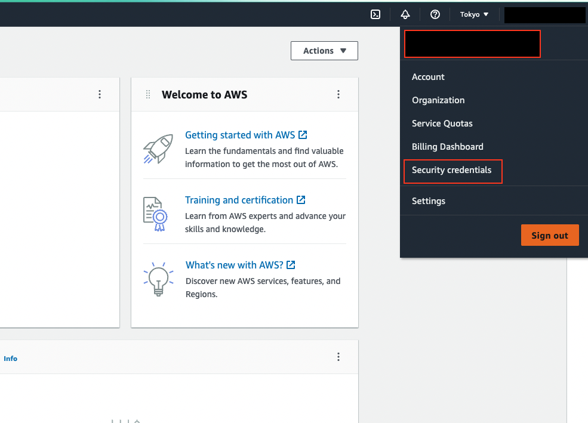
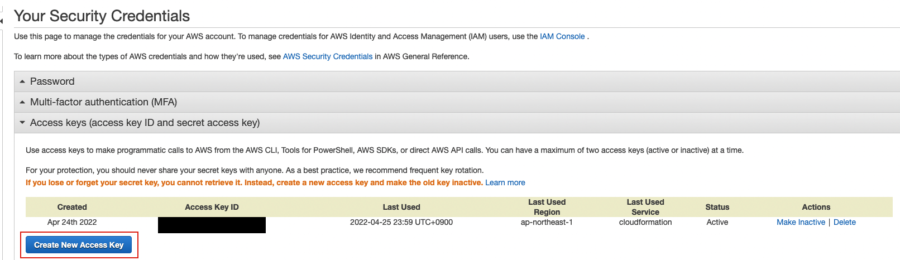
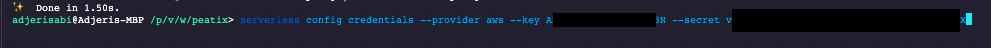
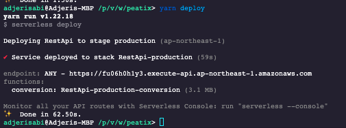

# API to convert Celsius to Fahrenheit or Fahrenheit to Celsius

## Quick setup

Please do the following to have the API working on your computer.

1. Install yarn via this [link](https://classic.yarnpkg.com/lang/en/docs/install) if it is not yet done
2. Open the navigator and browse to the project folder
3. Install all the required dependencies with the command below

```
yarn install
```

4. Make a copy of the `.env.example` to `.env`

```
cp .env.example .env
```

5. Start the project with

```
yarn dev
```

Please check the terminal for the URL of the server. By default, it will be http://localhost:3000

6. To run the tests, run

```
yarn test
```

7. [How to deploy](#how-to-deploy)

# Summary

The API's feature is to convert a temperature value in Celsius as input and gives the equivalent temperature in Farenheit as the output or convert a value in Celsius as input to Fahrenheit as output using the same endpoint.

## Query Parameters

We have the following query parameters:

- `value`: the value to convert, required, must be a number
- `from`: the unit to convert form, it can be `celsius` or `fahrenheit`, required
- `to`: the unit to convert to, it can be `celsius` or `fahrenheit`, required, must be different from `from`
- `decimal`: the number of decimal places to be returned, optional, must be a positive integer

A sample request to the API would look like `https://myserver/api/convert-temperature?value=100&from=celsius&to=fahrenheit`

## Headers

The client is required to put the `Content-Type` header as `application/json` in the request.

## Status code

The available status codes are as follows:

- `200`: Correct parameters are sent, the request was successful
- `422`: Incorrect parameters are sent, the request was not successful, some parameters could not pass the validation
- `500`: Internal server error, the server could not process the request or an error was encountered while processing the request
- `404`: The requested resource could not be found
- `429`: Too many requests, the server could not process the request

## Response

### Successful response

The response will be in the following format:

```
{
    "from": "Celsius",
    "to": "Fahrenheit",
    "decimal": 0,
    "value": 12,
    "result": 54,
    "resultRaw": "54°F"
}
```

### 422 response

A 422 response format will be as follows:

```
{
    "type": "error",
    "status": 422,
    "message": "Invalid input",
    "errors": [
        {
            "value": "p",
            "msg": "value must be a number",
            "param": "value",
            "location": "query"
        }
    ]
}
```

### 404 response format

A 404 response format will be as follows:

```
{
    "type": "error",
    "status": 404,
    "message": "The requested resource could not be found"
}
```

### 500 response format

A 500 response format will be as follows:

```
{
    "type": "error",
    "status": 500,
    "message": "Internal server error"
}
```

## Logging

To have an idea of the activities of the API, all access to the API as all the errors that occur will be logged as well.
Logs will be stored in a `log-YYYY-MM-DD.log` file in the `logs` directory. A log file will contain all activity of the related day.

## Rate Limiting

I implemented a rate limiting mechanism to prevent the API from being flooded with requests. This will also help prevent DDOS attacks.
The rate limit is set to `60` requests per minute for each IP address.

## Testing

For testing, I wrote a few unit and feature tests for the API. The unit tests are written in `tests/units.spec.js`  and the feature tests are written in `tests/feature.spec.js`. I used `jest` and `supertest` for the tests.
It is worth mentioning that the test suite is not exhaustive.

# Deployment

I decided to deploy the API on AWS Lambda and take advantage of the serverless architecture. Below are some of the reasons for that:

- It is easy to deploy and I can run my code without having to manage the infrastructure, AWS handles all the infrastructure
- It will scale automatically as the number of requests increase and decrease
- It is cost effective, only the compute time (by per-millisecond) will be charged
- It has a great integration with Node.js
- AWS offers lots of features to monitor the logs and to monitor the performance of the API

## How To Deploy

1. Create an account on [AWS](https://portal.aws.amazon.com/billing/signup#/start/email) and sign in
2. Go to `Security Credentials`



3. Create `Access Keys` or use the existing ones if you have. If you have created new ones, keep a copy of the `Access Key ID` and `Secret Access Key`



4. In your local machine, install globally `serverless` package using `npm install serverless -g`
5. Configure serverless credentials with the `Access Key ID` and `Secret Access Key` you created in step 3 by running

```
serverless config credentials --provider aws --key <Access Key ID> --secret <Secret Access Key>
```



6. In `serverless.yml` in the API project folder, update the parameters accordingly
7. From your terminal in the API project folder, deploy the API to AWS Lambda using the following command:

```
yarn deploy
```



You can see the newly created endpoint in the console after deployment. 

Happy dev!!!
